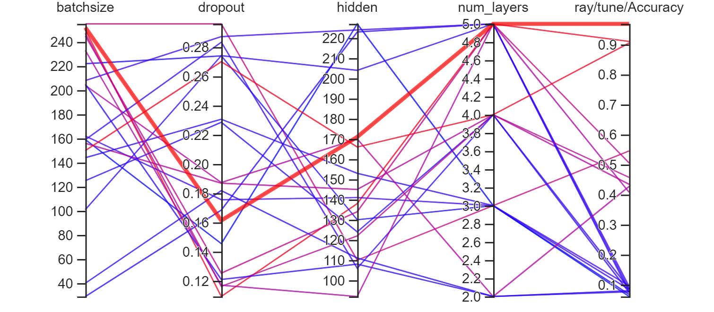
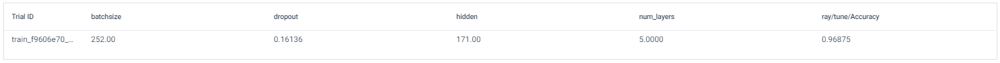
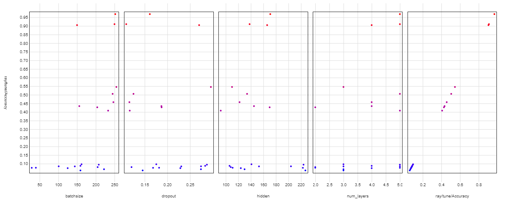

# Tentamen ML2022-2023

De opdracht is om de audio van 10 cijfers, uitgesproken door zowel mannen als vrouwen, te classificeren. De dataset bevat timeseries met een wisselende lengte.

In [references/documentation.html](references/documentation.html) lees je o.a. dat elke timestep 13 features heeft.
Jouw junior collega heeft een neuraal netwerk gebouwd, maar het lukt hem niet om de accuracy boven de 67% te krijgen. Aangezien jij de cursus Machine Learning bijna succesvol hebt afgerond hoopt hij dat jij een paar betere ideeen hebt.

## Vraag 1

### 1a
In `dev/scripts` vind je de file `01_model_design.py`.
Het model in deze file heeft in de eerste hidden layer 100 units, in de tweede layer 10 units, dit heeft jouw collega ergens op stack overflow gevonden en hij had gelezen dat dit een goed model zou zijn.
De dropout staat op 0.5, hij heeft in een blog gelezen dat dit de beste settings voor dropout zou zijn.

- Wat vind je van de architectuur die hij heeft uitgekozen (een Neuraal netwerk met drie Linear layers)? Wat zijn sterke en zwakke kanten van een model als dit in het algemeen? En voor dit specifieke probleem?
#### <span style="background-color: #197d2b">Antwoord:</span>
Een Neural Netwerk met Linear Layers is een relatief simpel model (In_features -> size of each input, out_features –> size of each output en een bias). Doordat het een (relatief) simpel model is dat helpt het om overfitting te voorkomen. Vanwege de simpliciteit en snelheid is het een goed basismodel om mee te starten. Dit is ook direct het grote nadeel van dit model. Doordat het een (algemeen) simpel model is behaald het niet altijd de hoogt mogelijke nauwkeurigheid. Kijkend naar de data en de vraag zal er dus gekeken moeten worden naar een meer specifiek model om een hogere nauwkeurigheid te behalen.
Voor dit specifieke probleem, zijnde classificatie van audio, is een model zoals deze niet de beste keuze. Om een hogere nauwkeurigheid te behalen kan er gekeken worden naar convolutional neural networks (CNNs) of misschien zelfs beter: Recurrent Neural Networks (RNN). RNN zijn specifiek goed in sequentiële gegevens zoals tekst, audio en video. 


- Wat vind je van de keuzes die hij heeft gemaakt in de LinearConfig voor het aantal units ten opzichte van de data? En van de dropout?
#### <span style="background-color: #197d2b">Antwoord:</span>
De vraagstelling vanuit de collega is om de data te classificeren. De data bestaat uit getalen van nul tot negen (n=10) uitgesproken in het Arabic door mannelijke en vrouwelijke (cat. n=2) sprekers. Dit betekent dat er in totaal 20 classes zijn die geïdentificeerd dienen te worden. Kijkend naar het geschreven model zien we het volgende:
```
(Getalen overgenomen om het leesbaar te maken)
nn.Linear(config["13"], config["100"]),
nn.ReLU(),
nn.Linear(config["100"], config["10"]),
nn.Dropout(config["0.5"]),
nn.ReLU(),
nn.Linear(config["10"], config["20"]),
```
De stappen die gemaakt worden in dit model zijn nogal groot. Van 13 units naar 100 units is een vrij grote stapt. Vervolgens wordt er een rectified linear unit (ReLU) toegepast als activatie functie (f(x)=max(0,x). De volgende stap is ook erg groot namelijk van 100 units terug naar 10 units. Daarna wordt er een Dropout functie toegepast om overfitting te voorkomen. Ook deze staat erg hoog afgesteld namelijk op 0.5 (i.e. de helft van de neurons wordt uitgeschakeld). Volgens de literatuur staat de dropout gebruikelijk tussen de 0.2 en 0.5. Na de dropout wordt er opnieuw een ReLU toegepast. Tot slot wordt er nog één stap gezet van 10 units naar 20 units. Gezien de vraag is een output van 20 units logisch. 

Mijn advies in deze zou zijn om de Dropout terug te brengen naar 0.2 en een logische verdeling te maken qua grote van units in de nn.Linear functie. Daarnaast, gezien de omvang van de data, is het ook verstandig om te kijken na een extra laag. Met het toevoegen van een extra laag kunnen de units beter verdeeld worden. In een handmatige test met de volgende configuratie is een nauwkeurigheid behaald van 0.7394
```
nn.Linear(config["13"], config["64"]),
nn.ReLU(),
nn.Linear(config["64"], config["32"]),
nn.Dropout(config["0.2"]),
nn.ReLU(),
nn.Linear(config["32"], config["20"]),
```


## 1b
Als je in de forward methode van het Linear model kijkt (in `tentamen/model.py`) dan kun je zien dat het eerste dat hij doet `x.mean(dim=1)` is. 
- Wat is het effect hiervan? Welk probleem probeert hij hier op te lossen? (maw, wat gaat er fout als hij dit niet doet?)
#### <span style="background-color: #197d2b">Antwoord:</span>
De complete functie is
```
    def forward(self, x: torch.Tensor) -> torch.Tensor:
        x = x.mean(dim=1)
        x = self.encoder(x)
        return x
```
Het deel x.mean(dim=1) pakt het gemiddelde van alles regels in een block. Uitkomst is één regel met 13 groepen van getallen. (e.g. -2.5929 -2.889 0.29554 -0.067409 0.28635 0.20898 0.41408 0.38878 0.37271 0.16329 0.0050341 0.12431 0.44326). Door dit te doen is het probleem opgelost dat de blocks verschillende lengtes hebben. Nadeel hiervan is wel dat er veel informatie verloren gaat. Deze stap is nodig omdat het gekozen model niet overweg kan met verschillende block lengtes. 

- Hoe had hij dit ook kunnen oplossen?
#### <span style="background-color: #197d2b">Antwoord:</span>
Andere opties zijn:
nn.Flatten(), nn.AvgPool2d(), nn.MaxPool2d()


- Wat zijn voor een nadelen van de verschillende manieren om deze stap te doen?
#### <span style="background-color: #197d2b">Antwoord:</span>
* nn.Flatten(): hervormd de data naar een 1-dim array
  * Nadeel: Kost veel geheugen en processing kracht. Daarnaast zorgt deze methoden er ook voor dat je (ruimtelijke) informatie verliest.
* nn.AvgPool2d(): pakt het gemiddelde van de gekozen window.
  * Nadeel: door het gemiddelde te pakken kan je belangrijke elementen uit de data kwijtraken. Daarnaast hebben outliers een groot effect op het gemiddelde. 
* nn.MaxPool2d(): pakt de mix waarde van de gekozen window. 
  * Nadeel: ook deze methoden kan leiden tot het verlies van informatie. Dit komt omdat alleen de max waarde van elke window wordt meegenomen. Door deze methoden gaan kleine details verloren. 


### 1c
Omdat jij de cursus Machine Learning hebt gevolgd kun jij hem uitstekend uitleggen wat een betere architectuur zou zijn.

- Beschrijf de architecturen die je kunt overwegen voor een probleem als dit. Het is voldoende als je beschrijft welke layers in welke combinaties je zou kunnen gebruiken.
#### <span style="background-color: #197d2b">Antwoord:</span>
Zoals eerder beschreven gaat het om een classificatie vraag. De dataset bestaat uit 8800 (10 cijfers x 10 herhalingen x 88 sprekers) tijdreeksen van 13 MFCCs. Na verkenning komende de volgende architecturen als beste naar boven gezien de vraag en gegeven dataset:


<figure>
  <p align = "center">
    
    <figcaption align="center">
      <b> Fig 1. RNN, GRU en LSTM</b>
    </figcaption>
  </p>
</figure>

* RNN
  * Goed voor tekst, audio of tijdreeksgegevens.
  * Heeft een “hidden state” zodat het netwerk informatie van eerdere elementen onthoud. 
  * Zeer geschrikt voor sequentie data.
* LSTM
  * Type RNN maar beter in het vasthouden van langetermijnrelaties in de data. 
  * Complexere structuur dan RNN zijnde: Input, output en forget gates.
  * Vaak gebruikt voor vertaal modellen en taalmodellering 
* GRU
  * Type RNN maar met een eenvoudiger structuur dan LSTM.
  * Gemakkelijk te trainen (i.v.m. LSTM).
  * Twee poorten: Update gate en een reset gate

Omdat we hier te maken hebben met sequentie data is het van belang om de context te bewaren uit het verleden (RNN grootste probleem is vanishing gradient problem). LSTM en GRU kunnen dat beide. Gezien de data en het vraagstuk valt mijn keuze op het maken van een GRU-model. Deze is makkelijker te trainen, minder complex maar biedt vrijwel dezelfde mogelijkheden. 

- Geef vervolgens een indicatie en motivatie voor het aantal units/filters/kernelsize etc voor elke laag die je gebruikt, en hoe je omgaat met overgangen (bv van 3 naar 2 dimensies). Een indicatie is bijvoorbeeld een educated guess voor een aantal units, plus een boven en ondergrens voor het aantal units. Met een motivatie laat je zien dat jouw keuze niet een random selectie is, maar dat je 1) andere problemen hebt gezien en dit probleem daartegen kunt afzetten en 2) een besef hebt van de consquenties van het kiezen van een range.
- Geef aan wat jij verwacht dat de meest veelbelovende architectuur is, en waarom (opnieuw, laat zien dat je niet random getallen noemt, of keuzes maakt, maar dat jij je keuze baseert op ervaring die je hebt opgedaan met andere problemen).

#### <span style="background-color: #197d2b">Antwoord:</span>
Voor het maken van een GRU-model zijn de volgende gegevens nodig (zie hieronder). Achter elk antwoord direct de overweging beschreven. 

|Name|Option|Reasoning|
|----|---|---|
|Input|13|I.v.m. de aantal features (aantal MFCC coefficients)|
|Hidden size|64|Mijn gevoel is dat dit een goed startpunt is. Dit kan nog veranderen naar 128 of zelfs 256, afhankelijk van de resultaten uit het experiment.|
|Output|20|Dit komt overeen met de aantal classes die geïdentificeerd moeten worden.|
|Number of layers|2 of 4|Op die manier zijn er voldoende lagen om het model te kunnen trainen.|
|Loss function|Cross-Entropy-Loss|Zoals besproken tijdens het college is dit het best passend bij classificatie.|
|Learning rate|0,001|Op basis van eerder uitgevoerde experimenten tijdens het college lijkt mij dit de beste keuze.|
|Optimizer|Adam|Deze neemt informatie mee (past gradients) om de learning rate aan te passen. Dit is het best passend voor dit vraagstuk.|


### 1d
Implementeer jouw veelbelovende model: 
- Maak in `model.py` een nieuw nn.Module met jouw architectuur 
- Maak in `settings.py` een nieuwe config voor jouw model
- Train het model met enkele educated guesses van parameters. 
- Rapporteer je bevindingen. Ga hier niet te uitgebreid hypertunen (dat is vraag 2), maar rapporteer (met een afbeelding in `antwoorden/img` die je linkt naar jouw .md antwoord) voor bijvoorbeeld drie verschillende parametersets hoe de train/test loss curve verloopt.
- reflecteer op deze eerste verkenning van je model. Wat valt op, wat vind je interessant, wat had je niet verwacht, welk inzicht neem je mee naar de hypertuning.

#### <span style="background-color: #197d2b">Antwoord:</span>
Omdat de input, output en de dropout al redelijk vaststaan heb ik hier alleen geëxperimenteerd met de hidden size en de num_layers. De optimizer is de beste keuze voor dit vraagstuk en expirimenteren met de learning_rate zou te veel gaan lijken op hypertuning. 
Het meest opvallende is dat dit model al vrij snel boven de 0.9300 komt. Een relatief groot effect heeft het aanpassen van de hidden size. De aanpassing van de num_layers heeft een minder groot effect dan verwacht. 


| Score |0.9389|0.9439|0.9632|0.9582|0.9605|0.9366|
|----|---|---|---|---|---|---|
|Data|20230129-1244|20230129-1250|20230129-1300|20230129-1311|20230129-1334|20230129-1344|
|input|13|13|13|13|13|13|
|output|20|20|20|20|20|20|
|hidden|64|128|256|256|128|64|
|dropout|0.2|0.2|0.2|0.2|0.2|0.2|
|num_layers|2|2|2|4|4|4|
|optimizer|Adam|Adam|Adam|Adam|Adam|Adam|
|learning_rate|0.001|0.001|0.001|0.001|0.001|0.001|

In de grafiek hieronder is te zien dat de eerste en laatste run beide geleidelijk dalen. Waar de andere vier runs vrij snel dalen voor dat ze afvlakken. Deze vier runs stoppen rond de 12 – 14 epoch met leren. De andere twee lijken door te gaan met leren nog tot in de 22ste epoch.

<figure>
  <p align = "center">
    
    <figcaption align="center">
      <b> Fig 2. Lost train</b>
    </figcaption>
  </p>
</figure>

In deze grafiek hieronder zien we hetzelfde als in de grafiek hierboven. De eerste en laatste run zijn gelijk en de andere vier zijn gelijk aan elkaar. 

<figure>
  <p align = "center">
    
    <figcaption align="center">
      <b> Fig 3. Lost test</b>
    </figcaption>
  </p>
</figure>

## Vraag 2
Een andere collega heeft alvast een hypertuning opgezet in `dev/scripts/02_tune.py`.

### 2a
Implementeer de hypertuning voor jouw architectuur:
- zorg dat je model geschikt is voor hypertuning
- je mag je model nog wat aanpassen, als vraag 1d daar aanleiding toe geeft. Als je in 1d een ander model gebruikt dan hier, geef je model dan een andere naam zodat ik ze naast elkaar kan zien.
- voeg jouw model in op de juiste plek in de `tune.py` file.
- maak een zoekruimte aan met behulp van pydantic (naar het voorbeeld van LinearSearchSpace), maar pas het aan voor jouw model.
- Licht je keuzes toe: wat hypertune je, en wat niet? Waarom? En in welke ranges zoek je, en waarom? Zie ook de [docs van ray over search space](https://docs.ray.io/en/latest/tune/api_docs/search_space.html#tune-sample-docs) en voor [rondom search algoritmes](https://docs.ray.io/en/latest/tune/api_docs/suggestion.html#bohb-tune-search-bohb-tunebohb) voor meer opties en voorbeelden.

#### <span style="background-color: #197d2b">Antwoord:</span>
Vanuit vraag 1 is naar voren gekomen dat een hidden van 128, Dropout van 0.2 en een Num_layers van 4 tot nu toe het beste resultaat heeft gegeven. vanuit een search online is naar voren gekomen dat het ook verstandig is om de batchsize mee te nemen in het hypertunen. Daarom deze ook meegenomen in de SearchSpace. 

Voor de eerste run de SearchSpace ingesteld met enige ruimte rond de parameters die in vraag 1 het beste resultaat hebben opgeleverd. 

```
class grumodelSearchSpace(BaseSearchSpace):
    hidden: Union[int, SAMPLE_INT] = tune.randint(64, 256)
    dropout: Union[float, SAMPLE_FLOAT] = tune.uniform(0.1, 0.3)
    num_layers: Union[int, SAMPLE_INT] = tune.randint(2, 6)
    batchsize: Union[int, SAMPLE_INT] = tune.randint(16, 256)
```


### 2b
- Analyseer de resultaten van jouw hypertuning; visualiseer de parameters van jouw hypertuning en sla het resultaat van die visualisatie op in `reports/img`. Suggesties: `parallel_coordinates` kan handig zijn, maar een goed gekozen histogram of scatterplot met goede kleuren is in sommige situaties duidelijker! Denk aan x en y labels, een titel en units voor de assen.
- reflecteer op de hypertuning. Wat werkt wel, wat werkt niet, wat vind je verrassend, wat zijn trade-offs die je ziet in de hypertuning, wat zijn afwegingen bij het kiezen van een uiteindelijke hyperparametersetting.
Importeer de afbeeldingen in jouw antwoorden, reflecteer op je experiment, en geef een interpretatie en toelichting op wat je ziet.

#### <span style="background-color: #197d2b">Antwoord:</span>
Vanuit vraag 1 neem ik het GRU model mee omdat ik daar al een nauwkeurigheid heb weten te behalen van zo’n 96%. Met de volgende parameters (uitgelegd in vraag 2a) ben ik gestart met het hypertunen:
Run 1
|Subject|Between| 
|---|---|
|Hidden|64, 256|
|Num_layers|2, 6|
|Dropout|0.1, 0.3|
|Batchsize|16, 256|
|Epochs|20|

<figure>
  <p align = "center">
    
    <figcaption align="center">
      <b> Fig 4. Grafiek run 1</b>
    </figcaption>
  </p>
</figure>

<figure>
  <p align = "center">
    
    <figcaption align="center">
      <b> Fig 5. Best score run 1</b>
    </figcaption>
  </p>
</figure>

<figure>
  <p align = "center">
    
    <figcaption align="center">
      <b> Fig 5. Best score run 1</b>
    </figcaption>
  </p>
</figure>


Hoge batch size
Lage dropout
Hidden rond de 170
Num_layers 5


Run 2
|Subject|Between| 
|---|---|
|Hidden|128, 256|
|Num_layers|4, 8|
|Dropout|0.1, 0.3|
|Batchsize|256, 512|
|Epochs|20|


### 2c
- Zorg dat jouw prijswinnende settings in een config komen te staan in `settings.py`, en train daarmee een model met een optimaal aantal epochs, daarvoor kun je `01_model_design.py` kopieren en hernoemen naar `2c_model_design.py`.

## Vraag 3
### 3a
- fork deze repository.
- Zorg voor nette code. Als je nu `make format && make lint` runt, zie je dat alles ok is. Hoewel het in sommige gevallen prima is om een ignore toe te voegen, is de bedoeling dat je zorgt dat je code zoveel als mogelijk de richtlijnen volgt van de linters.
- We werken sinds 22 november met git, en ik heb een `git crash coruse.pdf` gedeeld in les 2. Laat zien dat je in git kunt werken, door een git repo aan te maken en jouw code daarheen te pushen. Volg de vuistregel dat je 1) vaak (ruwweg elke dertig minuten aan code) commits doet 2) kleine, logische chunks van code/files samenvoegt in een commit 3) geef duidelijke beschrijvende namen voor je commit messages
- Zorg voor duidelijke illustraties; voeg labels in voor x en y as, zorg voor eenheden op de assen, een titel, en als dat niet gaat (bv omdat het uit tensorboard komt) zorg dan voor een duidelijke caption van de afbeelding waar dat wel wordt uitgelegd.
- Laat zien dat je je vragen kort en bondig kunt beantwoorden. De antwoordstrategie "ik schiet met hagel en hoop dat het goede antwoord ertussen zit" levert minder punten op dan een kort antwoord waar je de essentie weet te vangen. 
- nodig mij uit (github handle: raoulg) voor je repository. 
